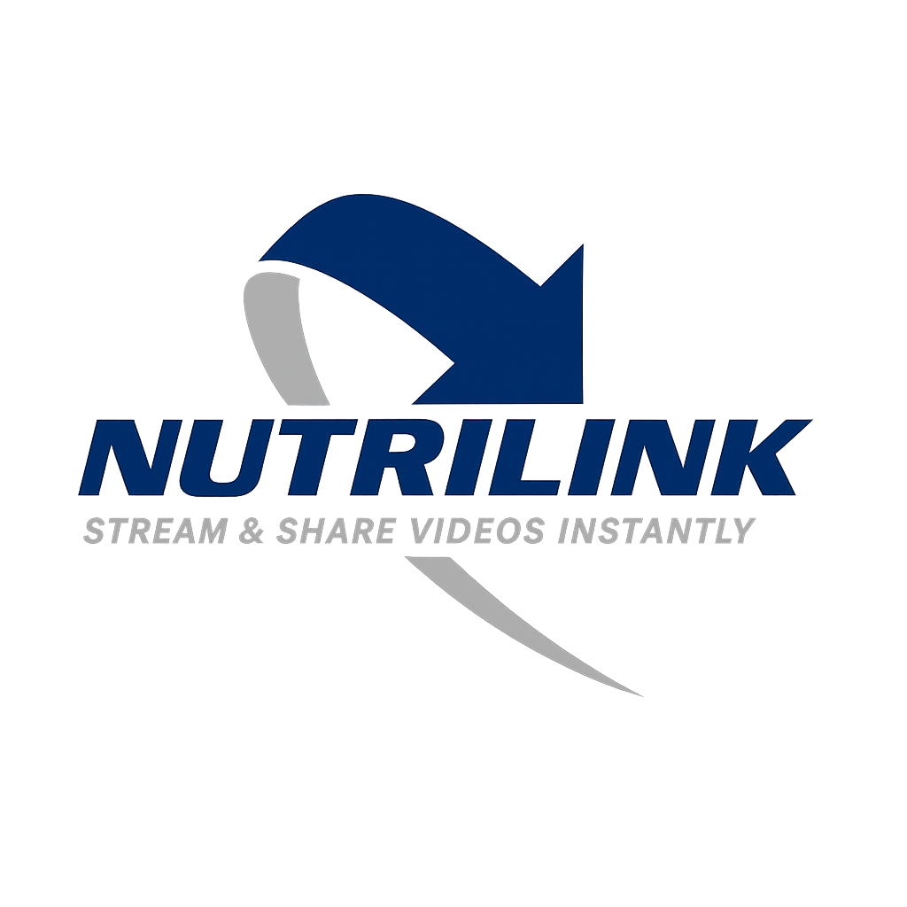

<p align="center">
  
</p>

<p align="center">🎬 Stream & Share Videos Instantly — Just Paste a Link</p>

---

## ✨ What is NutriLink?

**NutriLink** is a minimalist web app that lets you:

- Paste any public video URL (e.g., MP4 or WebM)
- Generate a unique, short link
- Share it with friends
- Watch videos instantly on a branded, hosted page
- Bonus: share via QR code, download video, or copy the link

---

## 📦 Features

- 📼 Modern video player (powered by Video.js)
- 🔗 Short vanity links: `nutrilink.vercel.app/v/abc123`
- 📥 Download video button
- 📱 Share via QR code or "Copy Link" button
- 💾 Fully client-side (no server required — yet)

---

## 🚀 How to Use

1. Visit [nutrilink.vercel.app](https://nutrilink.vercel.app)
2. Paste a direct video URL (must be publicly accessible)
   - Example: `https://www.w3schools.com/html/mov_bbb.mp4`
3. Click **Generate Link**
4. Share the new short link or scan the QR code
5. Watch the video on a clean, centered page

---

## 🛠 Local Development

```bash
git clone 
cd nutrilink
npm install
npm run dev
